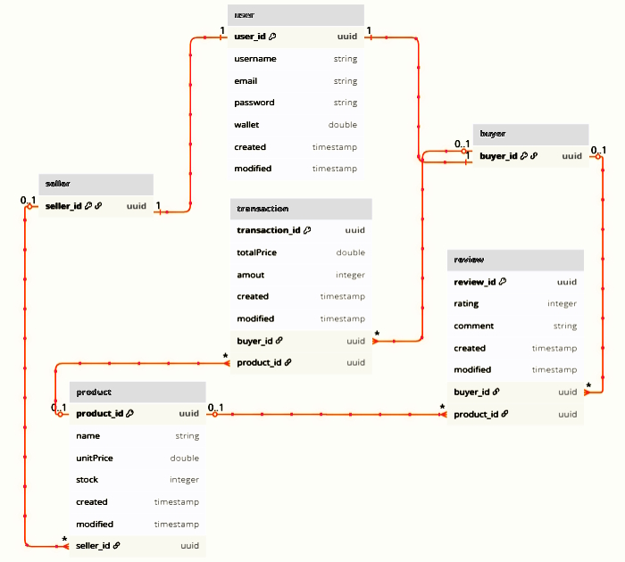

---

## Overview

This fully functional **RESTful backend** serves e-commerce applications. Designed with modern software engineering principles and built with **Spring Boot**, it provides robust API endpoints for managing users, products, transactions, and reviews, as well as with data persistence and test coverage.

---

## Features

- **Core E-Commerce Functionality** – Full suite of RESTful backend features including role-based user access (buyer/seller), management of product and transactions, and reviews with support for ratings and comments  
- **Data Persistence** – MySQL integration with JPA & Hibernate  
- **Robust Architecture** – Controller-Service-Repository layered pattern  
- **Unit & Integration Tests** – JUnit & Mockito-based test suite  
- **Containerized** – Docker-ready  

---

## Installation & Usage

## Usage
- Ensure Docker is installed and running, then:
```bash
cd marketplace-api
```
```bash
docker-compose up
```
- Open the project using an IDE (e.g., IntelliJ) and run it.
- Make HTTP requests (e.g., POST http://localhost:8080/user) with the necessary parameters (e.g., Body={"username":"test", "email":"test@email.com", "password":"test123", "wallet":0.0 })
- Note: Foreign key constraints apply when deleting entries.
- For the complete list of endpoints refer to the table below.


<details>
  <summary><h2>Endpoints</h2></summary>

  Description|HTTP Request Method|Route|Example of JSON Body 
  :------------- | :------------- | :------------- | :-------------
  | Create new user |POST| /user | {"username":"test","email":"test@email.com","password":"test123","wallet":0.0}
  | List all users |GET| /user | 
  | Get user by id |GET| /user/{id} | 
  | Update user by id |PUT| /user/{id} | { "username":"pparker", "password":"shazam123", "wallet":100.0 }
  | Delete user by id |DELETE| /user/{id} |
  | Create new product |POST| /seller/{sellerId}/product | {"name":"DSLR Camera","unitPrice":1000.00,"stock":3}
  | List products |GET| /seller/{sellerId}/product |
  | Create new transaction |POST| /buyer/{buyerId}/product | {"productId":"45616493-8006-4da7-933a-0f40615aa0d5","amount":2}
  | List transactions |GET| /buyer/{buyerId}/product |
  | Create new review |POST| /buyer/{buyerId}/product/{productId}/review | {"rating":5,"comment":"Great product, loved it!"}
  | List reviews |GET| /buyer/{buyerId}/product/{productId}/review |
  | List all products |GET| /product/ |
  | Get product by id |GET| /product/{productId} |
  | Update product by id |PUT| /product/{productId} | {"unitPrice":1200.00,"stock":2}
  | Delete product by id |DELETE| /product/{productId} |
  | List all reviews |GET| /review |
  | Get review by id |GET| /review/{reviewId} |
  | Update review by id |PUT| /review/{reviewId} | {"rating":5,"comment":"Really great product, loved it!"}
  | Delete review by id |DELETE| /review/{reviewId} |
  
</details>

---

## Database Structure

|  | 


